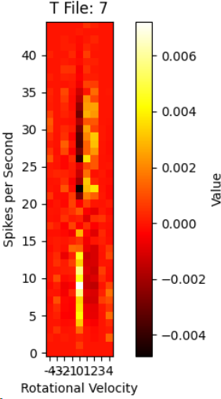

# NeuroEphys

This is a module I wrote that enables the analysis of behavioral data alongside neural electrophysiology data.

Some key features include:
## Reading T files
	spikes.reader.py
T files (e.g. TT8_08.T) are binary encoded timestamp files that hold information about the times when a neuron spiked. This module reads them out as a list of timestamps in seconds.

To convert the timestamp data to timeseries data with firing rates per unit time, use:
`analyzer.decompress_timestamp_data(timestamp_data, significant_digits_to_include)`

`read_t_files(t_files)`: reads a list of T files

## Reading Position Matrices
	positions.positions.py
Position matrices (e.g. HSpos_080602_ps17_160704.mat) are matrix files that contain at least 3 columns: time, x, and y. The module reads these columns into a PositionMatrix object that contains the data and various analysis functions.

These functions include:
- Smoothing `smooth_values()`
- Finding velocities `find_velocities()`
- Finding angles `find_angles()`
- Finding angular velocity `find_angular_velocity()`
- Finding rotational velocity `find_rotational_velocity()`

## Analysis
	analysis.analyzer.py
The analysis module provides many functions for analyzing the data in various ways.

These functions include:
- Applying a convolution on the timeseries data
- Converting two parallel timeseries into a mutual information matrix
  - For example:
  - 